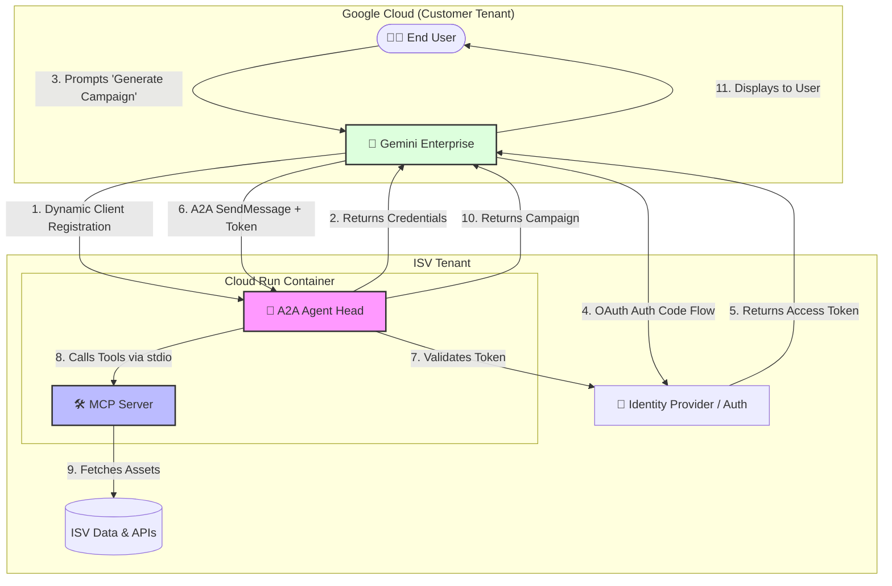
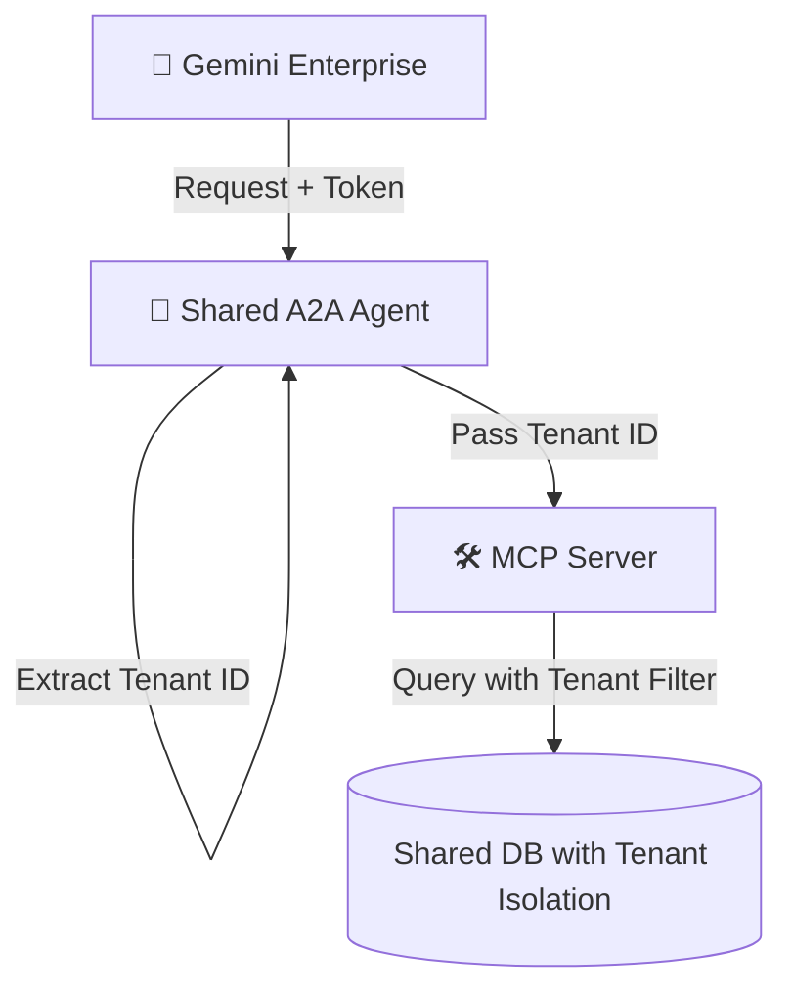
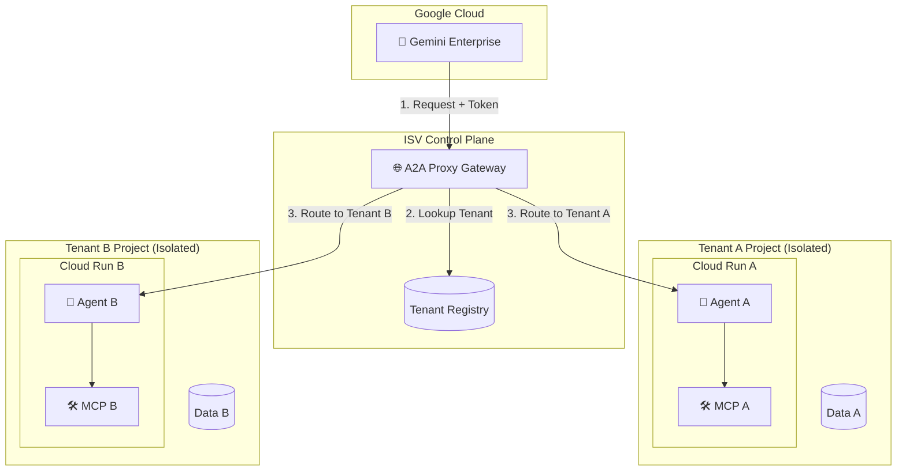
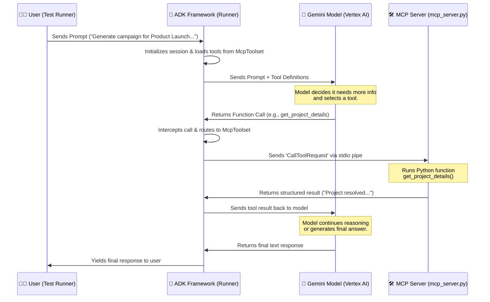

# A2A + MCP Agent Sample

This repository contains a sample implementation demonstrating how an ISV can front an existing **Model Context Protocol (MCP)** server with an **Agent-to-Agent (A2A)** layer to integrate with **Gemini Enterprise**.

## Table of Contents
- [1. End-to-End Architecture](#1-end-to-end-architecture)
- [2. Multi-Tenancy Patterns](#2-multi-tenancy-patterns)
  - [Pattern A: Shared Instance with Context Passing (Simpler)](#pattern-a-shared-instance-with-context-passing-simpler)
  - [Pattern B: Gateway + Dedicated Tenant Servers (Enterprise-Grade)](#pattern-b-gateway--dedicated-tenant-servers-enterprise-grade)
- [3. Prescriptive Guidance: Orchestration & MCP](#3-prescriptive-guidance-orchestration--mcp)
  - [Orchestration at the A2A Layer](#orchestration-at-the-a2a-layer)
  - [Local vs. MCP Tools](#local-vs-mcp-tools)
  - [MCP Tool Registration & Request Flow](#mcp-tool-registration--request-flow)
  - [Agent Card (agent.json)](#agent-card-agentjson)
  - [Error & Interrupt Handling](#error--interrupt-handling)
- [4. Getting Started](#4-getting-started)

## 1. End-to-End Architecture

The following diagram showcases the standard runtime flow, focusing on the technical execution and security handshakes.

## 2. Multi-Tenancy Patterns

When exposing this stack to multiple customers, you must choose an isolation strategy. Here are the two main patterns:

### Pattern A: Shared Instance with Context Passing (Simpler)
A single A2A agent handles all customers. Isolation is managed at the software level by passing the Tenant ID.

- **Pros**: Low cost, simple to deploy.
- **Cons**: Risk of cross-tenant data leakage if code has bugs.

### Pattern B: Gateway + Dedicated Tenant Servers (Enterprise-Grade)
A stateless gateway routes requests to isolated, tenant-specific server instances.

- **Pros**: Strict isolation, high security, data residency compliance.
- **Cons**: Higher infrastructure cost and management complexity.

## 3. Prescriptive Guidance: Orchestration & MCP

During our development and testing, we addressed common questions regarding agent orchestration and MCP integration:

### Orchestration at the A2A Layer
When fronting your services with an A2A agent, the orchestration burden shifts to the A2A agent. It receives the user prompt from Gemini Enterprise, breaks it down, and calls the necessary tools (local or remote via MCP) to gather context before generating the final response. This gives you full control over business logic and error handling.

### Local vs. MCP Tools
- In this sample (`a2a_agent.py`), tools are exposed via a real **MCP Server** (`mcp_server.py`) and consumed by the agent using the native Google ADK `McpToolset`.
- This demonstrates a production-grade setup where the agent communicates with the tool server via standard I/O (stdio).

### MCP Tool Registration & Request Flow

Here is how MCP tools are registered and how requests resolve to them in this native integration setup.

#### 1. Registration & Discovery
The agent uses `McpToolset` and `StdioServerParameters` to connect to the MCP server (`mcp_server.py`). At runtime, ADK queries the MCP server via `ListToolsRequest` to discover available tools and exposes them to the LLM as function declarations.

#### 2. Request Flow Sequence
The following sequence diagram illustrates how an incoming request resolves to MCP tools:

### Agent Card (`agent.json`)

The `agent.json` file at the root is the **Agent Card** (Discovery Document) required by the A2A protocol. It describes the agent's name, description, and skills. Gemini Enterprise reads this file at `.well-known/agent.json` to discover the agent's capabilities during Dynamic Client Registration.

### Error & Interrupt Handling
Review `test_e2e_simulation.py` for examples of how the agent should handle:
- **Missing Information**: Graceful degradation when the user prompt lacks required details.
- **Invalid Input**: Error handling when tools return errors (e.g., project not found).

## 4. Getting Started

For detailed instructions on how to build, deploy, and test this sample, please refer to the:

👉 **[USER_GUIDE.md](USER_GUIDE.md)**

For more details on security (OAuth, DCR) and Marketplace listing, see:
👉 **[MARKETPLACE_GUIDE.md](MARKETPLACE_GUIDE.md)**
