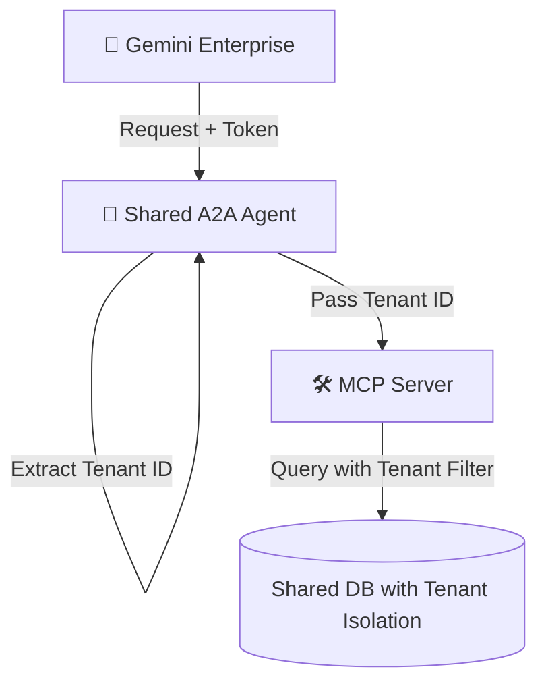

# A2A + MCP Agent Sample

This repository contains a sample implementation demonstrating how an ISV can front an existing **Model Context Protocol (MCP)** server with an **Agent-to-Agent (A2A)** layer to integrate with **Gemini Enterprise**.

## 1. End-to-End Architecture

The following diagram showcases the standard flow from procurement to consumption.

```mermaid
graph TD
    subgraph Google Cloud (Customer Tenant)
        User([🧑‍💻 End User])
        GE[🤖 Gemini Enterprise]
        MP[🛒 Google Cloud Marketplace]
    end

    subgraph ISV Tenant
        subgraph Cloud Run Container
            A2A[🤖 A2A Agent Head]
            MCP[🛠️ MCP Server]
        end
        IdP[🔐 Identity Provider / Auth]
        DB[(ISV Data & APIs)]
    end

    %% Flows
    User -->|1. Procures Agent| MP
    MP -->|2. Notifies Entitlement| A2A
    GE -->|3. Dynamic Client Registration| A2A
    A2A -->|4. Returns Credentials| GE
    User -->|5. Prompts 'Generate Campaign'| GE
    GE -->|6. OAuth Auth Code Flow| IdP
    IdP -->|7. Returns Access Token| GE
    GE -->|8. A2A SendMessage + Token| A2A
    A2A -->|9. Validates Token| IdP
    A2A -->|10. Calls Tools via stdio| MCP
    MCP -->|11. Fetches Assets| DB
    A2A -->|12. Returns Campaign| GE
    GE -->|13. Displays to User| User
```

## 2. Multi-Tenancy Patterns

When exposing this stack to multiple customers, you must choose an isolation strategy. Here are the two main patterns:

### Pattern A: Shared Instance with Context Passing (Simpler)
A single A2A agent handles all customers. Isolation is managed at the software level by passing the Tenant ID.


- **Pros**: Low cost, simple to deploy.
- **Cons**: Risk of cross-tenant data leakage if code has bugs.

### Pattern B: Gateway + Dedicated Tenant Servers (Enterprise-Grade)
A stateless gateway routes requests to isolated, tenant-specific server instances.

```mermaid
graph TD
    subgraph Google Cloud
        GE[🤖 Gemini Enterprise]
    end

    subgraph ISV Control Plane
        GW[🌐 A2A Proxy Gateway]
        TR[(Tenant Registry)]
    end

    subgraph Tenant A Project (Isolated)
        subgraph Cloud Run A
            A2A_A[🤖 Agent A]
            MCP_A[🛠️ MCP A]
        end
        DB_A[(Data A)]
    end

    subgraph Tenant B Project (Isolated)
        subgraph Cloud Run B
            A2A_B[🤖 Agent B]
            MCP_B[🛠️ MCP B]
        end
        DB_B[(Data B)]
    end

    GE -->|1. Request + Token| GW
    GW -->|2. Lookup Tenant| TR
    GW -->|3. Route to Tenant A| A2A_A
    GW -->|3. Route to Tenant B| A2A_B
    A2A_A --> MCP_A
    A2A_B --> MCP_B
```
- **Pros**: Strict isolation, high security, data residency compliance.
- **Cons**: Higher infrastructure cost and management complexity.

## 3. Getting Started

For detailed instructions on how to build, deploy, and test this sample, please refer to the:
👉 **[USER_GUIDE.md](USER_GUIDE.md)**

For more details on security (OAuth, DCR) and Marketplace listing, see:
👉 **[MARKETPLACE_GUIDE.md](MARKETPLACE_GUIDE.md)**
